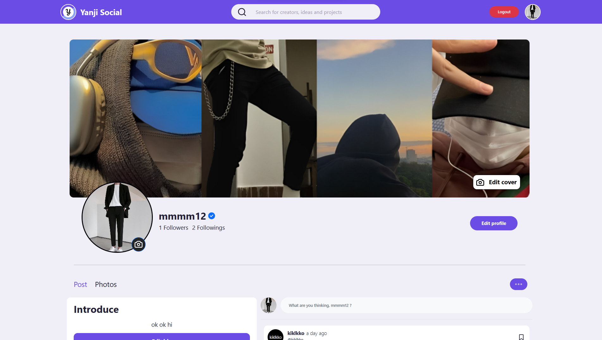
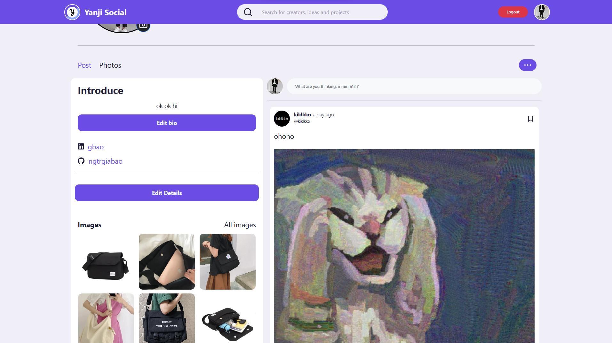
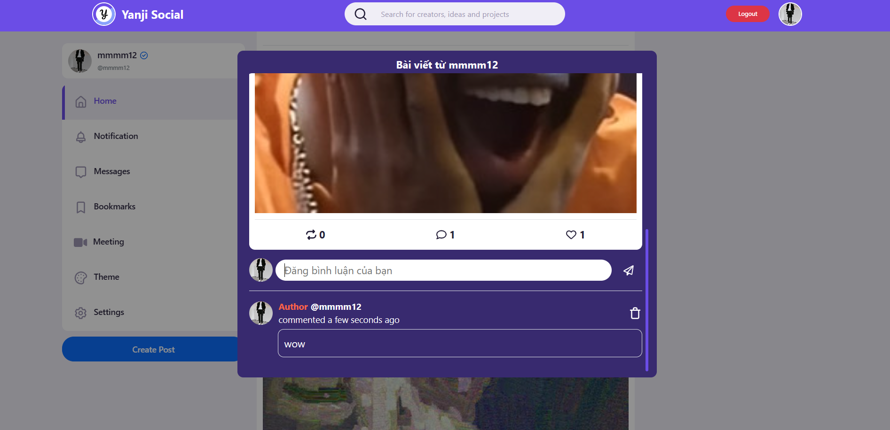
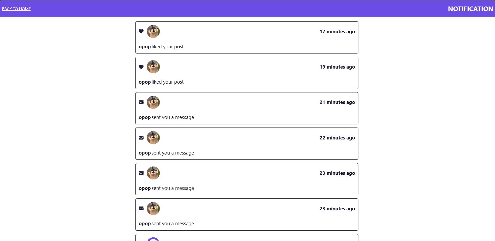
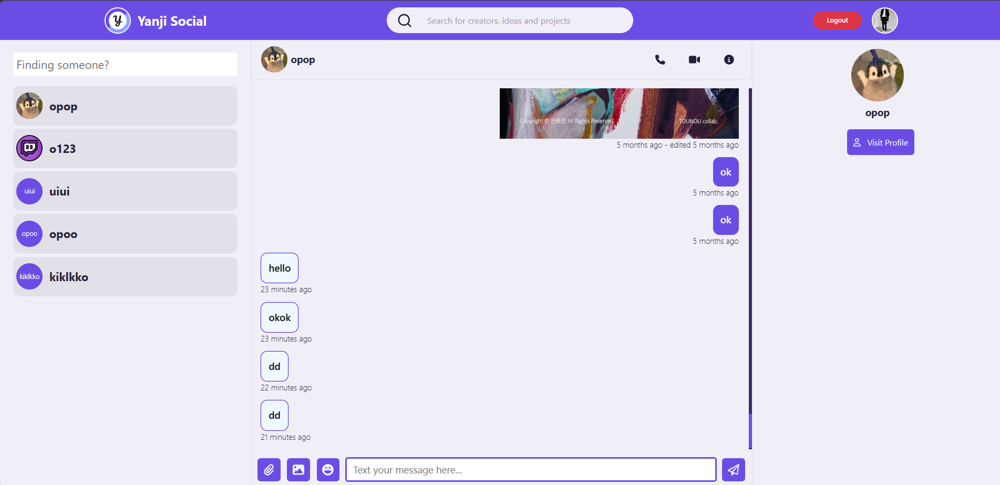
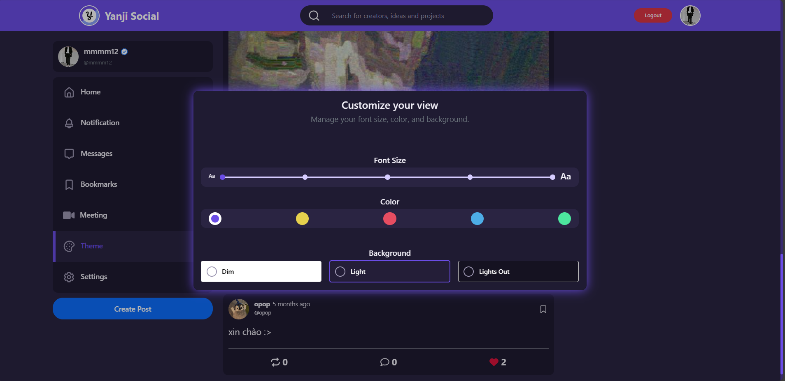
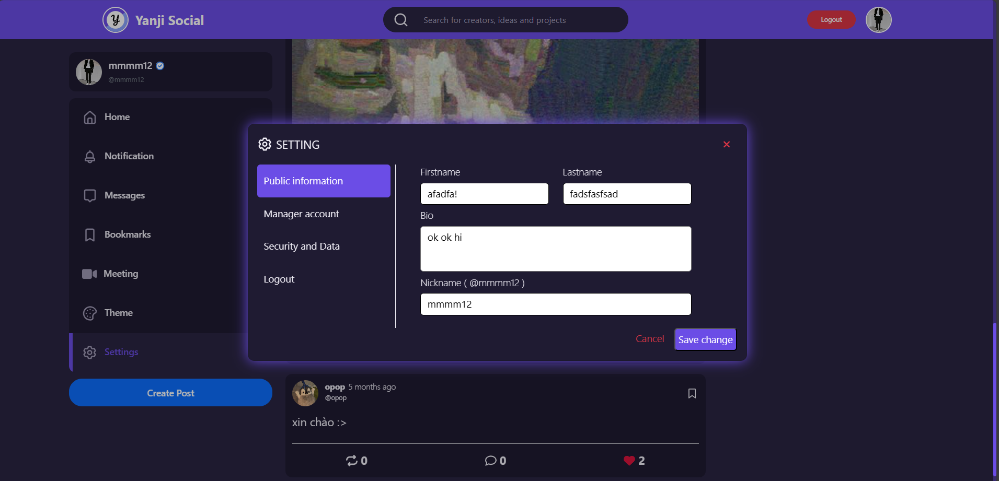

# Yanji Social

   

## Many thanks to our contributors
<p>
<a href="https://github.com/ngtrgiabao/yanji-social/graphs/contributors"></a>
</p>

### 🍍 Logo


# Overview











## 🌳Frontend
The frontend structure is organized into various components and pages, promoting modularity and maintainability. Notable folders include:

```
├───assets
│   ├───avatar
│   ├───background
│   ├───icons
│   ├───logo
│   ├───stories-images
│   └───video
├───business
├───components
│   └───style
├───context
│   └───theme
├───hooks
├───layout
│   └───navigation
│       └───style
├───pages
│   ├───bookmarks
│   ├───explore
│   ├───form
│   │   └───style
│   ├───home
│   │   ├───customTheme
│   │   │   └───style
│   │   └───style
│   ├───loading
│   │   └───style
│   ├───messages
│   │   └───style
│   ├───networkError
│   ├───notification
│   ├───personal
│   │   └───style
│   ├───postPreview
│   └───_404
│       └───style
├───redux
│   └───request
├───services
├───style
│   ├───animations
│   ├───constants
│   └───responsive
│       ├───big-tablet
│       ├───mobile
│       │   └───layout
│       └───small-laptop
└───utils
```

- assets: Holds avatar images, background images, icons, logos, stories images, and videos.
- business: Business-related functionalities.
- components: Reusable UI components.
- context: Manages the theme context.
- hooks: Custom React hooks.
- layout: Defines the application's layout, including navigation components.
- pages: Individual pages such as bookmarks, explore, form, home, loading, messages, network error, notification, personal, post preview, and a custom 404 page.
- redux: Redux state management for requests.
services: Backend services.
- style: Contains animations, constants, and responsive design for various devices.
- utils: Utility functions.

## 🌳Backend
The backend is structured with the following key components:
```
└───app
    ├───config
    ├───controllers
    ├───middleware
    ├───models
    ├───routes
    └───utils
```
- app: Main application folder.
  - config: Configuration settings.
  - controllers: Request handlers.
  - middleware: Middleware functions.
  - models: Data models.
  - routes: Application routes.
  - utils: Utility functions.

### [ 🥰 ] To run the app, you need to have config below

## BACKEND .env

<!-- ----- BACKEND .env ----- -->
```
SOCKET_PORT=9000
FRONTEND_URL="your_frontend_url"
MONGODB_URI="mongodb_remote_link"
CLOUD_STORAGE_NAME=""
CLOUD_STORAGE_API_KEY=""
CLOUD_SECRET_KEY=""
CLOUD_FOLDER_NAME=""
PlayFabSettingsDeveloperSecretKey=""
PlayFabSettingsTitleId=""
<!-- FRONTEND_URL="deploy_link" -->
<!-- MONGODB_URI="mongodb_local_link" -->
```

## FRONTEND .env
```
<!-- NEED CLOUDINARY ACCOUNT TO USE -->
REACT_APP_SOCKET_URL="your_backend_url"
REACT_APP_CLOUD_UPLOAD_PRESET=""
REACT_APP_CLOUD_STORAGE_NAME=""
REACT_APP_CLOUD_FOLDER=""
<!-- REACT_APP_SOCKET_URL="link_deploy_frontend" -->
```
